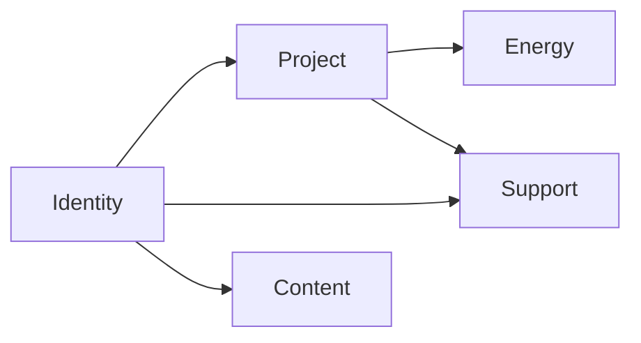
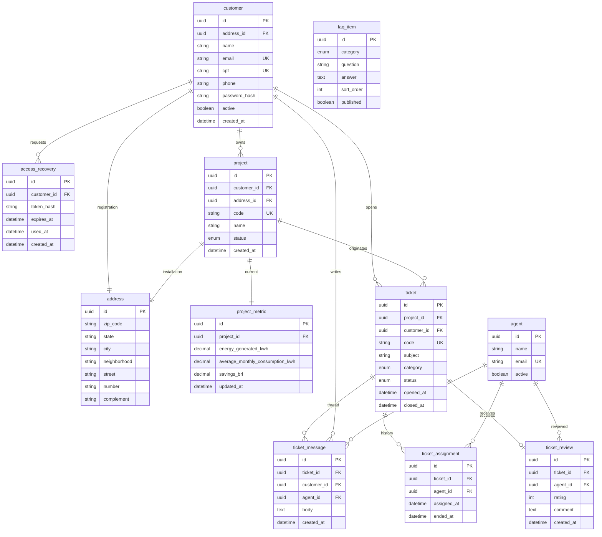

# Modelo de banco — Portal do Cliente (EcoVolt 360)

Esquema relacional modular alinhado ao fluxo de baixa fidelidade [DESKTOP - CLIENTE](https://www.figma.com/design/u5NqcocULLj0QEau2rcNIB/EcoVolt-360?node-id=1586-870) e às cardinalidades fechadas com o time.

Nomes de **tabelas, colunas e enums** em inglês (snake_case). Texto deste documento permanece em português.

Não inclui migration nem entidades JPA. Este documento é a fonte do ER.

## Decisões de relacionamento (fechadas)

| Relação | Cardinalidade / regra |
| --- | --- |
| Customer e Agent | Tabelas **separadas**. O portal autentica o customer; o agent existe para atribuição, mensagens e avaliação. |
| Customer e endereço de cadastro | **1:1**. CEP/rua do cadastro são do customer, não da usina. |
| Project e endereço da instalação | **1:1**. Endereço da instalação **é diferente** do cadastro. |
| Customer e Project | **1:N**. Um customer tem vários projects; um project tem um titular. |
| Project e instalação | **São a mesma entidade.** Não há tabela `installation` nem equipamento/inversor neste corte. |
| Métricas de energia | Valores **por project**; o dashboard **soma todos** os projects do customer. |
| Ticket e Project | **N:1 obrigatório.** Todo ticket pertence a um project. |
| Ticket e category | **Enum fixo** (não é tabela). |
| Status de project e ticket | **O mesmo enum:** pending, in review, in progress, awaiting installation, installation scheduled, installed, completed. |
| Ticket e Agent | **N:N temporal** (`ticket_assignment`): histórico com datas; o atual é a linha com `ended_at` nulo. |
| Ticket e mensagem | **1:N**. Sem anexos. |
| Avaliação | **1:1 com o ticket** e **N:1 com o agent** avaliado. |
| FAQ | Itens com category enum; **o mesmo conteúdo** na FAQ pública e no painel autenticado. |
| Recuperação de acesso | Link enviado por e-mail (OTP/token). Tabela de token, não Keycloak neste corte. |

## Módulos

- **Identity:** `customer`, `address`, `access_recovery`
- **Project:** `project` (a instalação solar)
- **Energy:** `project_metric`
- **Support:** `ticket`, `ticket_message`, `ticket_assignment`, `ticket_review`
- **Content:** `faq_item`

## Diagrama ER

## Dicionário de tabelas

Tipos ilustrativos (PostgreSQL). Datas em UTC.

### `address`

Endereço reutilizado pelo cadastro do customer e pela instalação do project (registros **distintos**).

| Coluna | Tipo | Nulo | Regras |
| --- | --- | --- | --- |
| `id` | UUID | não | PK |
| `zip_code` | CHAR(8) | não | CEP, só dígitos |
| `state` | CHAR(2) | não | UF (sigla IBGE) |
| `city` | VARCHAR(120) | não | |
| `neighborhood` | VARCHAR(120) | não | |
| `street` | VARCHAR(200) | não | |
| `number` | VARCHAR(20) | não | |
| `complement` | VARCHAR(120) | sim | |

### `customer`

Usuário do portal. Login: e-mail + senha.

| Coluna | Tipo | Nulo | Regras |
| --- | --- | --- | --- |
| `id` | UUID | não | PK |
| `address_id` | UUID | não | FK → `address.id`, **1:1** (unique) |
| `name` | VARCHAR(150) | não | Necessário na thread (“Olá Carlos”); o wireframe não mostrou o campo — incluir no cadastro |
| `email` | VARCHAR(255) | não | Unique, case-insensitive |
| `cpf` | CHAR(11) | não | Unique, só dígitos (identificador BR; nome da coluna permanece `cpf`) |
| `phone` | VARCHAR(13) | não | E.164 sem `+` ou DDD+número |
| `password_hash` | VARCHAR(255) | não | Nunca armazenar senha em claro |
| `active` | BOOLEAN | não | Default true |
| `created_at` | TIMESTAMPTZ | não | |

### `access_recovery`

Fluxo “esqueci a senha”: tela só com e-mail → link de acesso.

| Coluna | Tipo | Nulo | Regras |
| --- | --- | --- | --- |
| `id` | UUID | não | PK |
| `customer_id` | UUID | não | FK → `customer.id` |
| `token_hash` | VARCHAR(255) | não | Hash do token do link; unique |
| `expires_at` | TIMESTAMPTZ | não | |
| `used_at` | TIMESTAMPTZ | sim | Preenchido ao consumir o link |
| `created_at` | TIMESTAMPTZ | não | |

Invalidar tokens anteriores do mesmo customer ao emitir um novo (regra de aplicação).

### `agent`

Atendente. Sem login neste corte (backoffice fora do fluxo cliente).

| Coluna | Tipo | Nulo | Regras |
| --- | --- | --- | --- |
| `id` | UUID | não | PK |
| `name` | VARCHAR(150) | não | Exibido em “Atribuído: …” |
| `email` | VARCHAR(255) | sim | Unique se preenchido |
| `active` | BOOLEAN | não | Default true |

### `project`

Instalação solar do customer. Código de tela: `SOLAR-7842-SP`.

| Coluna | Tipo | Nulo | Regras |
| --- | --- | --- | --- |
| `id` | UUID | não | PK |
| `customer_id` | UUID | não | FK → `customer.id` |
| `address_id` | UUID | não | FK → `address.id`, **1:1** (unique) |
| `code` | VARCHAR(32) | não | Unique |
| `name` | VARCHAR(150) | não | Ex.: “Instalação Residencial” |
| `status` | ENUM | não | Ver enums |
| `created_at` | TIMESTAMPTZ | não | |

### `project_metric`

Snapshot atual por project. O painel agrega `SUM` de todos os projects do titular.

| Coluna | Tipo | Nulo | Regras |
| --- | --- | --- | --- |
| `id` | UUID | não | PK |
| `project_id` | UUID | não | FK → `project.id`, **1:1** (unique) |
| `energy_generated_kwh` | NUMERIC(14,3) | não | Default 0 |
| `average_monthly_consumption_kwh` | NUMERIC(14,3) | não | Default 0 |
| `savings_brl` | NUMERIC(14,2) | não | Default 0 |
| `updated_at` | TIMESTAMPTZ | não | |

Não há série temporal (leituras diárias) neste corte.

### `ticket`

| Coluna | Tipo | Nulo | Regras |
| --- | --- | --- | --- |
| `id` | UUID | não | PK |
| `project_id` | UUID | não | FK → `project.id` **obrigatória** |
| `customer_id` | UUID | não | FK → `customer.id` (titular que abriu; deve ser o titular do project) |
| `code` | VARCHAR(32) | não | Unique; ex. `TK-2026-0012` |
| `subject` | VARCHAR(200) | não | |
| `category` | ENUM | não | Ver enums |
| `status` | ENUM | não | Ver enums |
| `opened_at` | TIMESTAMPTZ | não | |
| `closed_at` | TIMESTAMPTZ | sim | Preenchido quando `status = COMPLETED` |

Constraint de aplicação: `ticket.customer_id` = `project.customer_id`.

### `ticket_message`

Thread única. Exatamente um autor: customer **ou** agent.

| Coluna | Tipo | Nulo | Regras |
| --- | --- | --- | --- |
| `id` | UUID | não | PK |
| `ticket_id` | UUID | não | FK → `ticket.id` |
| `customer_id` | UUID | sim | FK → `customer.id` |
| `agent_id` | UUID | sim | FK → `agent.id` |
| `body` | TEXT | não | |
| `created_at` | TIMESTAMPTZ | não | |

CHECK: `(customer_id IS NOT NULL AND agent_id IS NULL) OR (customer_id IS NULL AND agent_id IS NOT NULL)`.

Sem tabela de anexo.

### `ticket_assignment`

Histórico de responsáveis.

| Coluna | Tipo | Nulo | Regras |
| --- | --- | --- | --- |
| `id` | UUID | não | PK |
| `ticket_id` | UUID | não | FK → `ticket.id` |
| `agent_id` | UUID | não | FK → `agent.id` |
| `assigned_at` | TIMESTAMPTZ | não | |
| `ended_at` | TIMESTAMPTZ | sim | Nulo = atribuição vigente |

Índice unique parcial: um vigente por ticket (`UNIQUE (ticket_id) WHERE ended_at IS NULL`).

### `ticket_review`

Uma avaliação por ticket, ligada ao agent avaliado (em geral o vigente no encerramento).

| Coluna | Tipo | Nulo | Regras |
| --- | --- | --- | --- |
| `id` | UUID | não | PK |
| `ticket_id` | UUID | não | FK → `ticket.id`, **1:1** (unique) |
| `agent_id` | UUID | não | FK → `agent.id` |
| `rating` | SMALLINT | não | 1–5 |
| `comment` | TEXT | sim | |
| `created_at` | TIMESTAMPTZ | não | |

Só permitir quando o ticket estiver em `COMPLETED`.

### `faq_item`

| Coluna | Tipo | Nulo | Regras |
| --- | --- | --- | --- |
| `id` | UUID | não | PK |
| `category` | ENUM | não | Ver enums |
| `question` | VARCHAR(300) | não | |
| `answer` | TEXT | não | |
| `sort_order` | INT | não | Ordenação na lista |
| `published` | BOOLEAN | não | Default true; controla visibilidade nas duas superfícies |

## Enums

### `project.status` e `ticket.status` (mesmo vocabulário)

Project e ticket usam o **mesmo** conjunto de status.

| Valor | Rótulo (PT) |
| --- | --- |
| `PENDING` | Pendente |
| `IN_REVIEW` | Em revisão |
| `IN_PROGRESS` | Em progresso |
| `AWAITING_INSTALLATION` | Aguardando instalação |
| `INSTALLATION_SCHEDULED` | Instalação agendada |
| `INSTALLED` | Instalado |
| `COMPLETED` | Finalizado |

Ordem típica: `PENDING` → `IN_REVIEW` → `IN_PROGRESS` → `AWAITING_INSTALLATION` → `INSTALLATION_SCHEDULED` → `INSTALLED` → `COMPLETED`. A aplicação pode pular etapas; o banco não impõe a sequência.

Para ticket: `closed_at` e `ticket_review` somente em `COMPLETED`.

### `ticket.category` (fixo)

Valores alinhados ao painel.

Sugestão mínima para abertura:

- `PANEL_INVERTER`
- `BILLING_UTILITY`
- `OTHER`

### `faq_item.category`

- `SOLAR_ENERGY`
- `INSTALLATION_AND_PROJECTS`
- `MAINTENANCE`
- `PAYMENTS`
- `SUPPORT`

## Agregações do painel

Para o customer autenticado:

- **Meus projetos:** `COUNT(*)` em `project` onde `customer_id = :id`
- **Energia gerada / consumo médio / economia:** `SUM` em `project_metric` via join com `project` do customer
- **Chamados recentes:** `ticket` do customer, ordenado por `opened_at`
- **Atribuído:** `agent.name` da `ticket_assignment` com `ended_at IS NULL`

## Fora deste corte

Não modelar agora:

- Funil comercial, orçamento, agendamento de instalação
- Equipamento, inversor, bateria ou leituras diárias
- N customers no mesmo project
- Anexo em ticket ou mensagem
- Autenticação/sessão do agent (backoffice)
- FAQ distinta para anônimo vs logado
- Keycloak / IdP externo

## Índices sugeridos

- `customer (email)`, `customer (cpf)` — unique
- `project (customer_id)`, `project (code)` — unique em `code`
- `ticket (customer_id, opened_at DESC)`, `ticket (project_id)`, `ticket (code)` unique
- `ticket_message (ticket_id, created_at)`
- `faq_item (category, sort_order)` onde `published = true`
